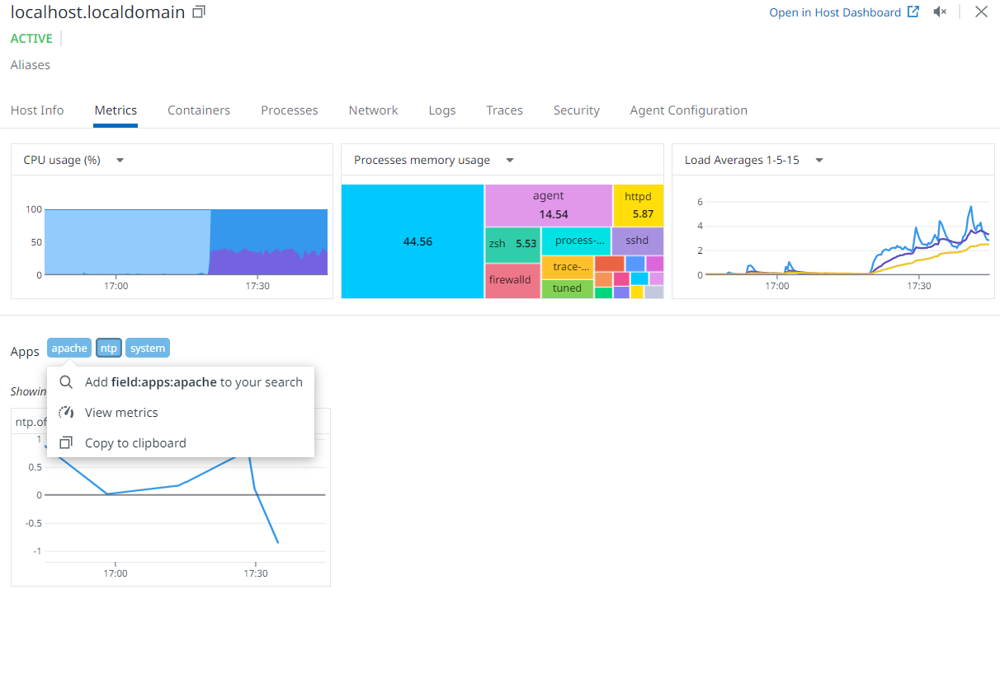

# DATA DOG -- Set up:
For this project I created a Centos VM using Vagrant, and installed the Datadog agent, where I created tags, set up dashboard regarding metrics from my virtual machine.

## What is Datadog? 
> It is an org/software used for monitoring:
* Infrastructure
* Cloud 
* APM
* RUM
* Container
* Security
* Logs

## STEP 1: 
1) Spin up Centos machine 
 
<code>
vagrant up
 
vagrant ssh
 
sudo yum update -y && sudo yum upgrade -y
 
</code>

1) Create DD trial membership:
2) Install DD Agent on VM : Create API key, run in CLI

4) Check out DD config file - ' /etc/datadog-agent/datadog.yaml'
5) Open datadog.yaml - <code>sudo vi /etc/datadog-agent/datadog.yaml</code>

6) Config file - can change host name, set tags as directed:

7) stop and restart dd agent to set changes: 
<code>
sudo systemctl stop datadog-agent
 
sudo systemctl start datadog-agent
</code>
8) Confirm DD agent is recognized on DD website/app and gathering metrics of VM:

   
9) Install EPEL repo, install Stress to run fake cpu load to catch data/metric on VM. 
<code>
sudo yum install epel-release
 
sudo yum install stress -y
</code>
10) Set up APACHE integration on DD:
* sudo yum install httpd
* sudo systemctl start httpd.service | systemctl status httpd.service

 
11) install mod status and enable to monitor web server load - https://www.tecmint.com/monitor-apache-web-server-load-and-page-statistics/

12) Confirmed from DD Metrics dashboard that Apache is integrated and providing metrics:

13) Ran stress test on machine to gather cpu metrics
 
<code>stress --cpu 2 --timeout 60</code>

14) Create a monitor based on host and metrics: - if host is down, will get notification from monitoring

15) Monitors are showing that apache is breaking threshold and sending alert. 
16) Create new dashboard listing specific metrics want to show :
